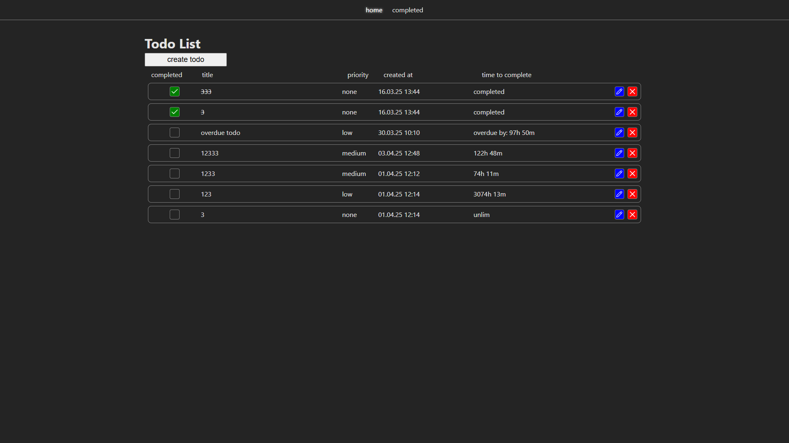
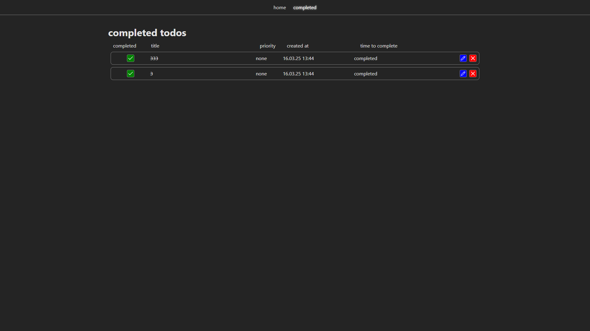

# To-Do List на Wails

## Описание проекта
Это десктопное приложение для управления списком задач (To-Do List), созданное с использованием Wails, Go и React.

## Основной функционал
- **Создание задач**:
  - Форма для создания задачи с названием, временем на выполнение и приоритетом.
  - Создание задач осуществляется через модальное окно.
- **Изменение задач**:
  - Возможность редактировать уже существующие задачи через модальное окно.
- **Отображение задач**:
  - Основной список задач отображает все невыполненные задачи.
  - Отдельная страница с выполненными задачами.
- **Изменение статуса задачи**:
  - Возможность отметить задачу как выполненную.
  - Отмеченные задачи перемещаются в раздел выполненных задач.
  - Можно отменить выполнение задачи.
- **Удаление задач**:
  - Возможность удалить задачу из списка.
- **Сохранение состояния**:
  - Данные хранятся в базе данных SQLite или в json файле.
  - В файле `.env` можно указать тип базы данных: `json` или `sqlite` (по умолчанию используется SQLite).
  - Задачи сохраняются при перезапуске приложения.

## Технологии
### Бэкенд:
- Wails
- Go
- SQLite для хранения данных (по умолчанию)

### Фронтенд:
- React
- TypeScript
- React Hook Form (rhf) для работы с формами
- SCSS для стилизации
- clsx для работы с классами
- Lucide React для иконок
- react-modal для модальных окон

## Интерфейс
### Главная страница:
- Форма для создания новых задач через модальное окно.
- Список всех задач.
- Кнопки удаления, редактирования и переключения статуса выполнения.

### Страница выполненных задач:
- Список только выполненных задач.
- Кнопки удаления, редактирования и переключения статуса выполнения.

## Установка и запуск
```sh
# клонировать репозиторий
git clone https://github.com/futfetish/todo-wails.git
cd todo-wails

# включить CGO (обязательно для работы sqlite)
export CGO_ENABLED=1  # для Linux/Mac
set CGO_ENABLED=1     # для Windows (cmd)

# запуск приложения в dev
wails dev
```

## Скриншоты
### главная страница

### адаптивность до 480px в ширину

### как работает форма

### удаление

### страница выполненых задач

